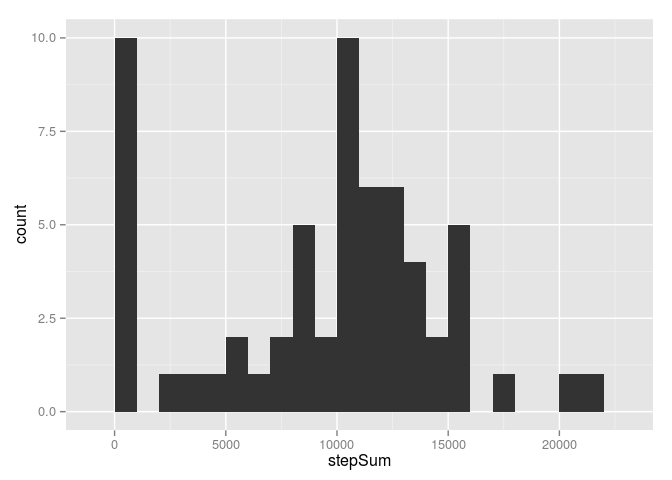
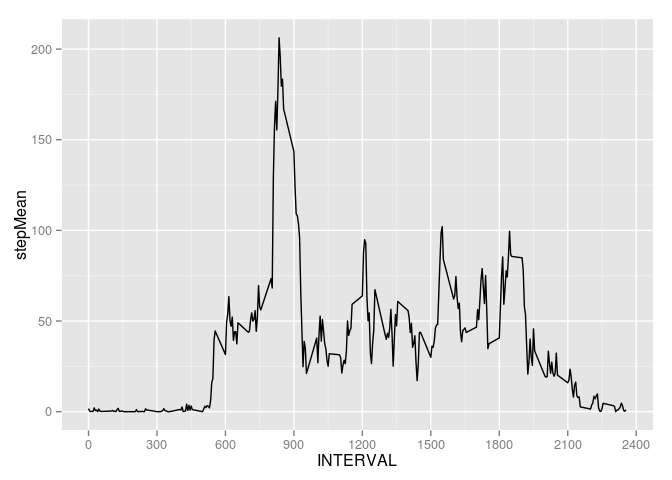
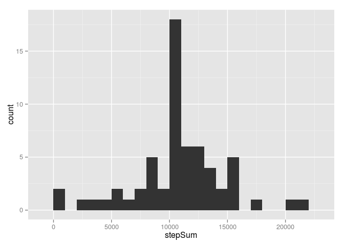
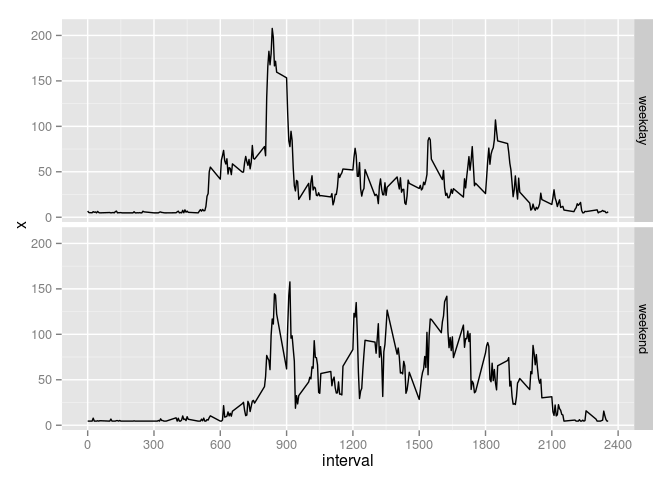

# Reproducible Research: Peer Assessment 1

## Loading libraries, init environment

```r
library(ggplot2)
#Sys.setlocale("LC_TIME", "English")      # Windows
#Sys.setlocale("LC_TIME", "en_US.UTF-8")   # Linux
#Sys.setenv(LANG="en")
```

## Loading and preprocessing the data

```r
# read data 
setwd("/media/bob2/DATA-ASUS/rstat/RR/RepData_PeerAssessment1/")
actData <- read.csv("./data/activity.csv", header = T, sep = ",")
```

## What is mean total number of steps taken per day?


```r
# Make a histogram of the total number of steps taken each day
stp <- tapply(actData$steps, actData$date, sum, na.rm = TRUE)
stepsDF <- data.frame(date=names(stp),stepSum=stp)
qplot(stepSum, data = stepsDF, binwidth = 1000)
```

 

```r
# Calculate and report the mean and median total number of steps taken per day
meanSteps <- mean(stepsDF[,2])
medianSteps <- median(stepsDF[,2])

cat("Mean of total number of steps:", meanSteps)
```

```
## Mean of total number of steps: 9354.23
```

```r
cat("Median of total number of steps:", medianSteps)
```

```
## Median of total number of steps: 10395
```

## What is the average daily activity pattern?

```r
# Make a time series plot of the 5-minute interval and the average number of steps taken, averaged across all days 
intervals <- tapply(actData$steps, actData$interval, mean, na.rm = TRUE)
itrvDF <- data.frame(interval=names(intervals),stepMean=intervals)
itrvDF$INTERVAL <- as.numeric(levels(itrvDF$interval))[itrvDF$interval]
ggplot(itrvDF, aes(x = INTERVAL, y = stepMean)) + 
        geom_line() +
        scale_x_continuous(breaks = c(0, 300, 600, 900, 1200, 1500, 1800, 2100, 2400))
```

 

```r
# Which 5-minute interval, on average across all the days in the dataset, contains the maximum number of steps?

maxSteps <- (which.max(itrvDF[,2]))
cat("Average maximum steps across all days contains interval:", names(maxSteps))
```

```
## Average maximum steps across all days contains interval: 835
```

## Imputing missing values

```r
# Calculate and report the total number of missing values in the dataset (i.e. the total number of rows with NAs)

mis <- nrow(actData[actData$steps == "NA" , ])
cat("The total number of missing values:", mis)
```

```
## The total number of missing values: 2304
```

```r
# Devise a strategy for filling in all of the missing values in the dataset. 
# STRATEGY DESCRIPTION: 
# replace NAs with overall median

# Create a new dataset that is equal to the original dataset but with the missing data filled in.

actData2 <- actData

actData2[is.na(actData2)] <- medianSteps/288    # 24*60/5


#Make a histogram of the total number of steps taken each day 
stp2 <- tapply(actData2$steps, actData2$date, sum, na.rm = TRUE)
stepsDF2 <- data.frame(date=names(stp2),stepSum=stp2)
qplot(stepSum, data = stepsDF2, binwidth = 1000)
```

 

```r
# Calculate and report the mean and median total number of steps taken per day. 

meanSteps2 <- mean(stepsDF2[,2])
medianSteps2 <- median(stepsDF2[,2])

cat("Mean of total number of steps (NAs filled):", meanSteps2)
```

```
## Mean of total number of steps (NAs filled): 10717.51
```

```r
cat("Median of total number of steps (NAs filled):", medianSteps2)
```

```
## Median of total number of steps (NAs filled): 10395
```

```r
# Do these values differ from the estimates from the first part of the assignment? What is the impact of imputing missing data on the estimates of the total daily number of steps?


cat("The mean of total number of steps of dataset with filled in NA values is ", 100*meanSteps2/meanSteps-100, "% biger then the original dataset.")
```

```
## The mean of total number of steps of dataset with filled in NA values is  14.57393 % biger then the original dataset.
```

```r
cat("The median of total number of steps of dataset with filled in NA values is ", 100*medianSteps2/medianSteps-100, "% biger then the original dataset.")
```

```
## The median of total number of steps of dataset with filled in NA values is  0 % biger then the original dataset.
```

```r
cat("Imputing missing values has significant impact on MEAN and no impact on MEDIAN.")
```

```
## Imputing missing values has significant impact on MEAN and no impact on MEDIAN.
```

## Are there differences in activity patterns between weekdays and weekends?


```r
# For this part the weekdays() function may be of some help here. 
# Use the dataset with the filled-in missing values for this part.

# Create a new factor variable in the dataset with two levels -- "weekday" and "weekend" indicating whether a given date is a weekday or weekend day.

actData2$day <- format((as.Date(actData2$date)), "%u") # weekend c(6, 7)
actData2$day <- as.factor(actData2$day)
#actData2["DAY"] =""
actData2[actData2$day %in% c(6, 7), "DAY"] <- "weekend"
actData2[actData2$day %in% c(1:5), "DAY"] <- "weekday"
actData2$DAY <- as.factor(actData2$DAY)

# Make a panel plot containing a time series plot of the 5-minute interval and the average number of steps taken, averaged across all weekday days or weekend days. 

itrvDF2 <- aggregate(actData2$steps, by=list(DAY = actData2$DAY, interval = actData2$interval), FUN = mean, na.rm = TRUE)

ggplot(itrvDF2, aes(x = interval, y = x)) + 
        geom_line() +
        scale_x_continuous(breaks = c(0, 300, 600, 900, 1200, 1500, 1800, 2100, 2400)) + 
        facet_grid(DAY ~ .)
```

 


